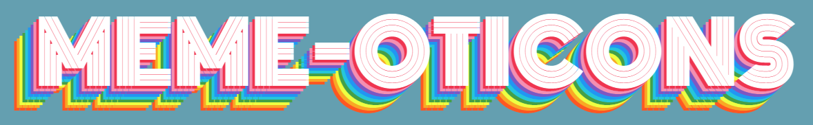
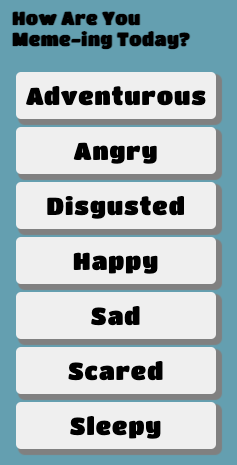
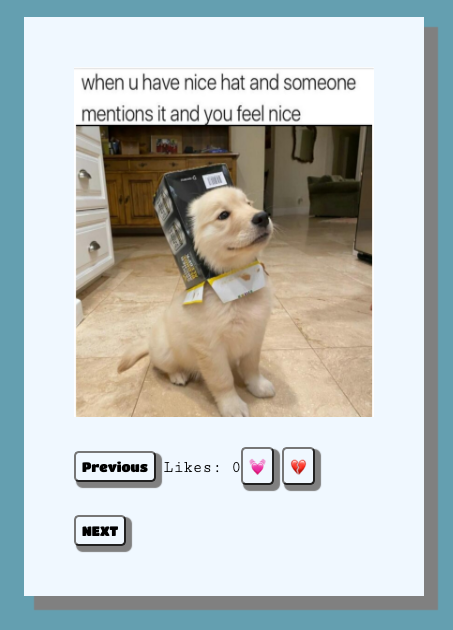
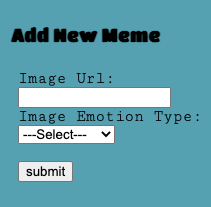

# Phase One Project - Meme-oticons



## Description

When utilizing Meme-oticons, users are able to view memes based on a chosen feeling from a provided list. Users can then click through different memes and can also like or dislike specific ones. If a user would like to add a new meme to a certain emotion, there is a form for that!

## Usage

This page uses data located in a db.json file and requires the user to have json-server installed to access that data. The user should run this command to access the server:

```bash
$ json-server --watch db2.json
```

## Visuals

Clicking an emotion:



Liking/disliking a meme:



Adding a new meme:




## Happy Meme-ing!!!